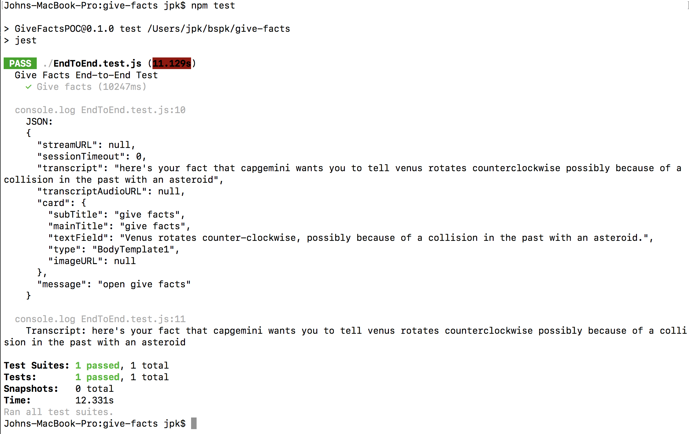

# Background
This project shows a super-simple example of how the Virtual Device SDK works.

# Setup
Install Node.js - instructions below:  
https://nodejs.org/en/download/

Clone the repository:
```sh
git clone https://github.com/jkelvie/give-facts
```

Install the dependencies:
```sh
cd give-facts
npm install
```

Setup environment:
* Rename the file example.env as .env
* Change the value for VIRTUAL_DEVICE_TOKEN to the token from https://apps.bespoken.io on the Validation page

# Run
Run the test:
```sh
npm test
```

View the output:



